以下是对操作系统核心概念的系统性讲解，结合经典教材《操作系统概念（第七版）》的框架，分为六个部分帮助您建立完整知识体系：

------

# 一、操作系统的本质与核心目标

**定义**
 操作系统（OS）是计算机硬件与用户/应用程序之间的​**​中介层​**​，核心职责包括：

1. **资源管理者**：统一管控CPU、内存、I/O设备等硬件资源（教材1.1.2节）
2. **服务提供者**：为应用程序提供文件系统、进程控制等基础服务（第2章）
3. **系统保护者**：通过隔离机制防止程序越权访问硬件（第14-15章）

**双重设计目标**

- **用户视角**：提升易用性（如GUI界面、API抽象）
- **系统视角**：优化资源利用率（如多任务调度、虚拟化技术）

> *教材案例*：手持设备OS需平衡功耗与响应速度（1.11.3节）

------

# 二、操作系统核心功能模块

## 1. 进程管理（第3-7章）

- **进程 vs 线程**

  - 进程：资源分配的基本单位（含代码段、数据段、PCB）
  - 线程：CPU调度的基本单位（共享进程资源）

  > *实现模型*：Windows XP采用1:1线程模型（4.5.1节）


- **进程同步机制**

  | 机制     | 原理                       | 典型应用          |
  | -------- | -------------------------- | ----------------- |
  | 信号量   | P/V原子操作控制资源访问    | 生产者-消费者问题 |
  | 管程     | 封装同步操作的抽象数据类型 | Java同步块        |
  | 原子事务 | ACID特性保证操作原子性     | 数据库系统        |

### 1.1进程间是如何进行通信？可以写几个例子给我看看。

wsl：cd  "/mnt/c/program file"


### 1.2共享内存通信

在 C++ 中，使用 **System V 共享内存**（System V Shared Memory）是一种常见的进程间通信方式。下面是一个简单的共享内存通信示例，分为两个程序：

- `server.cpp`：创建共享内存并写入数据；
- `client.cpp`：连接到共享内存并读取数据。

---

#### ✅ 示例目标

- 使用共享内存进行进程间通信；
- `server` 写入数据；
- `client` 读取数据；
- 使用 `sleep(2)` 模拟同步（简单场景下使用）；
- 使用标准的 System V 共享内存接口（POSIX 也可以，但此处用 System V）。

---

#### 📁 文件结构

```
shared_memory_example/
├── server.cpp
├── client.cpp
```

---

#### 🟦 server.cpp

```cpp
#include <iostream>
#include <cstdlib>
#include <cstring>
#include <sys/ipc.h>
#include <sys/shm.h>
#include <unistd.h>  // for sleep()

#define SHM_KEY 1234
#define SHM_SIZE 1024

int main() {
    // 创建共享内存段
    int shmid = shmget(SHM_KEY, SHM_SIZE, IPC_CREAT | 0666);
    if (shmid == -1) {
        perror("shmget failed");
        return 1;
    }

    // 将共享内存附加到当前进程
    char *shm = (char *)shmat(shmid, nullptr, 0);
    if (shm == (char *)-1) {
        perror("shmat failed");
        return 1;
    }

    // 写入数据
    const char *message = "Hello from shared memory!";
    strcpy(shm, message);
    std::cout << "Server: Wrote message to shared memory." << std::endl;

    // 等待客户端读取
    sleep(2);

    // 分离共享内存
    if (shmdt(shm) == -1) {
        perror("shmdt failed");
        return 1;
    }

    // 删除共享内存
    if (shmctl(shmid, IPC_RMID, nullptr) == -1) {
        perror("shmctl(IPC_RMID) failed");
        return 1;
    }

    return 0;
}
```

---

#### 🟩 client.cpp

```cpp
#include <iostream>
#include <cstdlib>
#include <cstring>
#include <sys/ipc.h>
#include <sys/shm.h>

#define SHM_KEY 1234
#define SHM_SIZE 1024

int main() {
    // 获取共享内存段
    int shmid = shmget(SHM_KEY, SHM_SIZE, 0666);
    if (shmid == -1) {
        perror("shmget failed");
        return 1;
    }

    // 将共享内存附加到当前进程
    char *shm = (char *)shmat(shmid, nullptr, 0);
    if (shm == (char *)-1) {
        perror("shmat failed");
        return 1;
    }

    // 读取数据
    std::cout << "Client: Read from shared memory: " << shm << std::endl;

    // 分离共享内存
    if (shmdt(shm) == -1) {
        perror("shmdt failed");
        return 1;
    }

    return 0;
}
```

---

#### 🛠 编译与运行

##### 编译：

```bash
g++ server.cpp -o server
g++ client.cpp -o client
```

##### 运行：

1. 先运行 `server`：

   ```bash
   ./server
   ```

2. 在另一个终端中运行 `client`：

   ```bash
   ./client
   ```

---

#### 📌 注意事项

- **同步问题**：此示例中通过 `sleep(2)` 实现同步，仅适用于教学演示。实际生产环境中应使用信号量（semaphore）或其它同步机制。
- **共享内存清理**：若 `server` 异常终止，可能残留共享内存。可使用 `ipcs -m` 查看，`ipcrm -m <shmid>` 删除。
- **权限问题**：确保运行用户对共享内存有权限（0666 表示所有用户可读写）。
- **跨平台兼容性**：System V 共享内存主要在 Linux 上使用，Windows 下通常使用其他 IPC 机制（如 Memory Mapped Files）。

---

#### ✅ 输出示例

运行结果如下：

```
Server: Wrote message to shared memory.
Client: Read from shared memory: Hello from shared memory!
```

---

#### 🧩 延伸建议

- 加入信号量实现读写同步；
- 使用结构体传递复杂数据；
- 使用 `ftok()` 生成更稳定的 key；
- 尝试使用 POSIX 共享内存（`shm_open()` + `mmap()`）实现跨平台支持。

---

如果你希望我提供 **POSIX 版本** 或 **Windows 上的共享内存实现**，也可以继续告诉我！


### 1.3客户机与服务器通信的三种策略，套接字，远程程序，管道。

在 Linux 环境下使用 C/C++ 实现客户机/服务器通信的三种核心策略（套接字、远程过程调用、管道），以下是详细实现方案和代码示例：

---

### 1. 套接字通信（Sockets）
#### 技术原理
使用 TCP/UDP 协议在 IP 网络上通信，通过 `socket()` 系统调用创建通信端点

#### 实现代码
**服务器端 (TCP)**
```cpp
#include <sys/socket.h>
#include <netinet/in.h>
#include <unistd.h>
#include <cstring>
#include <iostream>

int main() {
    // 创建套接字
    int server_fd = socket(AF_INET, SOCK_STREAM, 0);
    
    // 绑定地址
    sockaddr_in address{};
    address.sin_family = AF_INET;
    address.sin_addr.s_addr = INADDR_ANY;
    address.sin_port = htons(8080);
    bind(server_fd, (sockaddr*)&address, sizeof(address));
    
    // 监听连接
    listen(server_fd, 5);
    std::cout << "Server listening on port 8080..." << std::endl;
    
    // 接受连接
    sockaddr_in client_addr{};
    socklen_t addr_len = sizeof(client_addr);
    int client_socket = accept(server_fd, (sockaddr*)&client_addr, &addr_len);
    
    // 通信
    char buffer[1024] = {0};
    read(client_socket, buffer, 1024);
    std::cout << "Received: " << buffer << std::endl;
    send(client_socket, "Hello from server", 17, 0);
    
    close(client_socket);
    close(server_fd);
    return 0;
}
```

**客户端 (TCP)**
```cpp
#include <sys/socket.h>
#include <netinet/in.h>
#include <arpa/inet.h>
#include <unistd.h>
#include <iostream>

int main() {
    int sock = socket(AF_INET, SOCK_STREAM, 0);
    
    sockaddr_in serv_addr{};
    serv_addr.sin_family = AF_INET;
    serv_addr.sin_port = htons(8080);
    inet_pton(AF_INET, "127.0.0.1", &serv_addr.sin_addr);
    
    connect(sock, (sockaddr*)&serv_addr, sizeof(serv_addr));
    send(sock, "Hello from client", 17, 0);
    
    char buffer[1024] = {0};
    read(sock, buffer, 1024);
    std::cout << "Server response: " << buffer << std::endl;
    
    close(sock);
    return 0;
}
```

#### 关键参数


---

### 2. 远程过程调用（RPC）
#### 技术原理
使用 Sun RPC 框架实现跨进程函数调用，通过 XDR 进行数据序列化

#### 实现步骤
1. **定义接口文件 (`rpc_demo.x`)**：
```rpcgen
program RPC_DEMO {
    version VERSION_1 {
        string PROCESS_DATA(string) = 1;
    } = 1;
} = 0x20000001;
```

2. **生成桩代码**：
```bash
rpcgen rpc_demo.x
```

3. **服务器实现 (`server.cpp`)**：
```cpp
#include "rpc_demo.h"
#include <cstring>

char ** process_data_1_svc(char **input, struct svc_req *req) {
    static char *result;
    char *input_data = *input;
    
    // 处理数据（示例：转换为大写）
    for(int i=0; input_data[i]; i++){
        input_data[i] = toupper(input_data[i]);
    }
    
    result = strdup(input_data);
    return &result;
}
```

4. **客户端调用 (`client.cpp`)**：
```cpp
#include "rpc_demo.h"
#include <iostream>

int main() {
    CLIENT *cl = clnt_create("localhost", RPC_DEMO, VERSION_1, "tcp");
    
    char *input = strdup("hello rpc");
    char **result = process_data_1(&input, cl);
    
    std::cout << "Result: " << *result << std::endl;
    clnt_destroy(cl);
    return 0;
}
```

#### 部署流程

```mermaid
sequenceDiagram
    participant C as Client
    participant S as Server
    participant P as Portmapper
    C->>P: 查询服务端口
    P->>C: 返回端口号
    C->>S: RPC调用请求
    S->>C: 返回处理结果
```


---

### 3. 管道通信（Pipes）
#### 技术原理
使用内核管道缓冲区进行进程间通信，分为匿名管道和命名管道

#### 匿名管道（父子进程间）
```cpp
#include <unistd.h>
#include <sys/wait.h>
#include <iostream>

int main() {
    int pipefd[2];
    pipe(pipefd);  // 创建管道
    
    if(fork() == 0) { // 子进程
        close(pipefd[0]);  // 关闭读端
        write(pipefd[1], "Child message", 14);
        close(pipefd[1]);
        _exit(0);
    } 
    else { // 父进程
        close(pipefd[1]);  // 关闭写端
        char buf[100];
        int count = read(pipefd[0], buf, sizeof(buf));
        std::cout << "Received: " << buf << " (" << count << " bytes)" << std::endl;
        close(pipefd[0]);
        wait(NULL);
    }
    return 0;
}
```

#### 命名管道（FIFO - 无关进程间）
**服务器端**：
```cpp
#include <fcntl.h>
#include <sys/stat.h>
#include <unistd.h>
#include <iostream>

int main() {
    mkfifo("/tmp/demo_fifo", 0666);  // 创建FIFO
    
    int fd = open("/tmp/demo_fifo", O_RDONLY);
    char buf[100];
    read(fd, buf, sizeof(buf));
    std::cout << "Server received: " << buf << std::endl;
    close(fd);
    unlink("/tmp/demo_fifo");
    return 0;
}
```

**客户端**：
```cpp
#include <fcntl.h>
#include <unistd.h>

int main() {
    int fd = open("/tmp/demo_fifo", O_WRONLY);
    write(fd, "Hello FIFO", 11);
    close(fd);
    return 0;
}
```

---

### 三种策略对比分析
| **特性**          | 套接字               | RPC                | 管道              |
| ----------------- | -------------------- | ------------------ | ----------------- |
| **通信范围**      | 跨网络               | 跨网络             | 同一主机          |
| **复杂度**        | ★★★ (需处理网络细节) | ★★★★ (需定义IDL)   | ★★ (简单)         |
| **性能**          | 高 (TCP/UDP原生支持) | 中 (有序列化开销)  | 极高 (内核缓冲区) |
| **数据格式**      | 字节流/数据报        | 结构化数据 (XDR)   | 字节流            |
| **典型应用**      | Web服务、实时通信    | 分布式系统、微服务 | 进程间数据流      |
| **Linux系统调用** | socket/bind/connect  | rpcgen/clnt_create | pipe/mkfifo       |

---

### 选择建议
1. **跨网络通信** → 优先选择 **套接字** (灵活) 或 **RPC** (结构化)
2. **高性能IPC** → 选择 **命名管道** (FIFO)，吞吐量可达 5GB/s+
3. **简单进程交互** → 使用 **匿名管道** (fork() 场景)
4. **分布式系统** → **RPC** + Protocol Buffers/Thrift (更现代的实现)

> **性能提示**：在 Linux 5.4+ 内核中，使用 `splice()` 系统调用配合管道可实现零拷贝数据传输，比传统 `read()/write()` 快 3 倍以上。

```cpp
// 零拷贝管道示例
int pipefd[2];
pipe(pipefd);
splice(source_fd, NULL, pipefd[1], NULL, 4096, SPLICE_F_MOVE);
splice(pipefd[0], NULL, dest_fd, NULL, 4096, SPLICE_F_MOVE);
```


## 2. 内存管理（第8-9章）

- **核心问题**：解决有限物理内存 vs 无限程序需求的矛盾

- 

  关键技术演进

  ：

  ```
  graph LR
  A[连续分配] --> B[外部碎片问题]
  B --> C[分页机制]
  C --> D[虚拟内存]
  D --> E[按需调页+页面置换]
  ```

- **虚拟内存创新**：写时复制（Copy-on-Write）技术减少进程fork开销（9.3节）

#### 3. 存储管理（第10-13章）

- 

  文件系统双层抽象

  ：

  - 逻辑层：树状目录结构（10.3.5节）
  - 物理层：磁盘块分配策略（连续/链式/索引）

- 

  磁盘调度算法对比

  ：

  | 算法 | 特点                 | 适用场景     |
  | ---- | -------------------- | ------------ |
  | FCFS | 简单公平，寻道时间长 | 负载较轻系统 |
  | SSTF | 最小寻道时间优先     | 易致饥饿现象 |
  | SCAN | 电梯扫描，无饥饿     | 高负载系统   |

#### 4. 保护与安全（第14-15章）

- 

  访问控制矩阵

  （14.4节）：

  ```
  +---------+------+-------+-------+
  | 主体/客体| 文件A| 内存B | 设备C |
  +---------+------+-------+-------+
  | 用户X   | 读   | 执行  | -      |
  | 进程Y   | 读写 | -     | 控制   |
  +---------+------+-------+-------+
  ```

- 

  安全威胁防护

  ：

  - 缓冲区溢出防御：栈随机化（ASLR）、不可执行栈（NX bit）
  - 认证机制：生物识别（15.5.5节）

------

### 三、现代操作系统演进方向

#### 1. 分布式系统（第16-18章）

- **核心挑战**：网络延迟、部分故障、时钟同步
- **一致性协议**：两阶段提交（2PC）实现分布式事务（18.3节）

#### 2. 实时嵌入式系统（第19章）

- **关键指标**：时限（Deadline）保障

- 

  调度算法

  ：

  - 单调速率（RMS）→ 周期性任务
  - 最早截止期优先（EDF）→ 动态优先级调整

#### 3. 多媒体系统（第20章）

- 

  QoS保障机制

  ：

  - 磁盘调度：SCAN-EDF混合算法（20.5.2节）
  - 网络传输：RSVP协议预留带宽（20.6节）

------

### 四、经典操作系统实现对比

| 系统       | 内核架构      | 创新技术           | 教材章节 |
| ---------- | ------------- | ------------------ | -------- |
| Linux      | 宏内核+模块化 | Ext2日志文件系统   | 第21章   |
| Windows XP | 混合内核      | NTFS事务恢复机制   | 第22章   |
| Mach       | 微内核        | 基于端口的安全通信 | 附录A    |

------

### 五、学习操作系统的方法论

1. 

   理论-实践循环

   ：

   - 通过编程项目理解概念（如实现生产者-消费者问题）

2. 

   跨层思维

   ：

   - 理解从硬件中断（13.2节）到系统调用（2.3节）的完整路径

3. 

   演进视角

   ：

   - 对比早期批处理系统（23.1节）与现代云原生OS的异同

> **教材特别提示**：第七版新增15+实战项目（如Linux系统调用扩展），建议结合POSIX/Win32 API实践（前言“编程练习”部分）

------

### 六、关键问题思考

1. 为何现代OS普遍采用**分页式内存管理**而非分段式？（8.6节）
2. **多核处理器**如何影响调度算法设计？（5.4节负载均衡策略）
3. **容器技术**（如Docker）与传统虚拟机的本质区别？（2.8节虚拟机原理）

此框架覆盖操作系统核心知识体系，建议结合教材具体章节深化理解。后续可针对任一模块展开详细讨论。